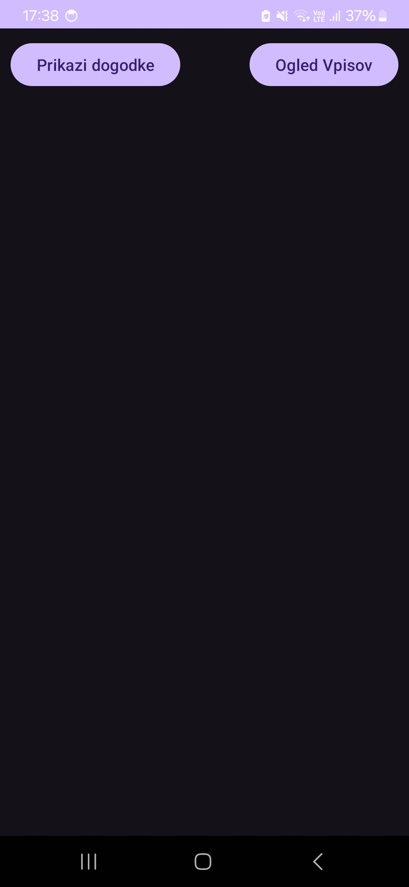
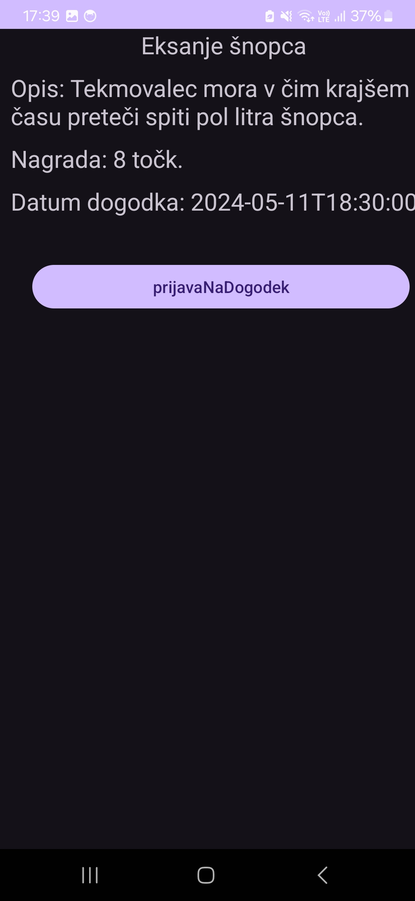

# eMajskeIgre App
Gre za mobilno aplikacijo kjer se lahko študent preko API prijavi na dogodek Majskih Iger. Je mobilna verzija spletne aplikacije [eMajskeIgre](https://emajskeigre.azurewebsites.net/)

## Uporaba
Uporaba aplikacije je preprosta. Z klikom na gumb "Prikazi dogodke" se nam na zaslonu prikazejo vsi dogodki. Z klikom na dogodek lahko pridobimo podrobnosti o le tem.
Izvemo kako se bo dogodek odvijal, kdaj ter koliko točk lahko prinesem svojemu študentskemu domu, če se uvrsti prvi. V primeru, da dogodek študentu ustreza se nanj prijavi z klikom na "prijavaNaDogodek".
Če bi si študent rad ogledal prijave na dogodke lahko to stori na začetnem zaslonu z pritiskom na gumb "Ogled Vpisov". Tam se izpišejo vsi vpisi, katere je ta študent izvedel.

  
<em><b>Slika 1: Home Screen</b></em>

  
   

  
<em><b>Slika 2: Dogodki</b></em>

  
   

  
<em><b>Slika 3: Podrobnosti dogodka</b></em>

  
   

  
<em><b>Slika 4: Vse prijave uporabnika</b></em>

  
   

  
<em><b>Slika 5</b>: Enrollments View Organizator</b></em>

  
   

