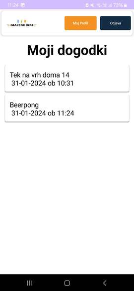
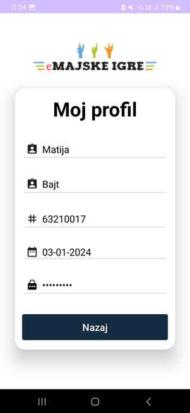

# [eMajskeIgre](https://github.com/MatijaBajt32/eMajskeIgreAndroidApp) – Android mobilna aplikacija

Miha Lazić (63210183), Matija Bajt (63210017)

**Opis domene**

Z informacijskim sistemom eMajskeIgre želimo podpreti procese prijav na največjem študentskem dogodku Majskih igrah. V sklopu le-tega se vsako leto prirejajo tekmovanja, ki študentskim domovom prinašajo točke glede na uvrstitve njihovih študentov. Do sedaj so se študenti morali fizično prijaviti na tekmovanja, naš sistem bo pa to digitaliziral. Omogoča prijavo kot ‘študent’ ali ‘organizator’, pri čemer bo študentu na voljo pregled vseh razpisanih tekmovanj in prijavo oz. odjavo na le-te, organizator pa bo lahko dogodke dodajal, urejal, brisal in imel evidenco o številu prijavljenih študentov za posamezen študentski dom. S tem smo študentu olajšali samo prijavo na tekmovanja, organizator pa ima informacijo, ali naj tekmovanje sploh izvede. Možnost za izboljšavo je hramba točk, ki jih za neko tekmovanje prinese neki študent za neki študentski dom (s tem imamo npr pregled nad najboljšimi tekmovalci).

**Mobilna aplikacija eMajske**
Aplikacija predstavlja mobilno verzijo poenostavljene spletne aplikacije [eMajskeIgre](https://github.com/MatijaBajt32/eMajskeIgre), ki smo jo realizirali v IDE okolju Android Studio. Njena glavna funkcionalnost je **prijava Študenta na posamezen dogodek na Majskih igrah**. Podatke črpa preko spletne aplikacije in njene baze, ki ju gostujemo na oblaku Microsoft Azure.

**Izgled in uporaba**

  <b>Prijava</b>
   
  Uporabnik (študent) se v aplikacijo prijavi s svojo vpisno številko in geslom. V primeru, da njegov računa ne obstaja, se lahko registrira na gumb Registrirajte se.
   
  

  
  

   

  <b>Registracija</b>
   
Študent pri registraciji vnaša potrebne podatke, pri katerih se preverja sintaktična pravilnost le-teh. S klikom na gumb Registracija se ustvari nov profil in študent se lahko prijavi v aplikacijo.
   
  

  
    

   

  <b>Glavna stran</b>
   
  Na prvi strani lahko vidi vse dogodke, za letošnje Majske igre 2024, na katere se lahko prijavi. Za dodatne informacije lahko enostavno klikne na posamezen dogodek. S klikom na gumb Moji dogodki pa se mu prikažejo dogodki, na katere se je prijavil.
   
  

  
    

   

  <b>Opis dogodka</b>
   
  Na tem activity-u lahko študent vidi podrobnejše informacije o poteku dogodka in s klikom na gumb Prijava se lahko nanj tudi prijavi. Onemogočena je prijava na isti dogodek večkrat.
   
  

  
    

   

  <b>Osebne prijave na dogodke</b>
   
  Tukaj študent vidi dogodke, na katere se je prijavil. S klikom nanj lahko prijavo izbriše.
   
  

  
  

   

  <b>Moj profil</b>
   
  S klikom na gumb Moj profil si lahko študent ogleda svoje osebne podatke in le te tudi popravi.
   
  

  
  

   

